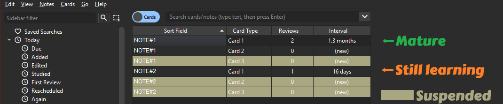
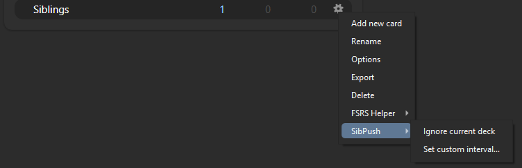

# SibPush: Delay New Sibling Cards in Anki

<center>
    
</center>

## Overview

Meet SibPush, your Anki addon that likes to keep new sibling cards at a chill distance. It suspends new sibling cards until their older siblings have matured, then brings them back when the deck browser is opened again. No more awkward family reunions in your review sessions!

## Purpose

So here’s the deal. Normally when you bump into a new card, Anki shoves its siblings to the side for just a day. Not cool, right? SibPush steps in to save the "spaced" in spaced repetition. It suspends the new siblings that should wait and checks for recovery on the next deck browser render. Once the remaining siblings are mature enough, the suspended cards are unsuspended again. This way, you get to avoid cramming and actually remember stuff long-term. It’s all about keeping the learning groove going at a neat pace.

Unlike other similar addons that only act when a note is reviewed in AnkiDesktop, SibPush uses multiple triggers so it can catch up after syncs. That means reviews on AnkiMobile and AnkiWeb still get processed when the desktop collection reloads.

## Usage

1. Install the addon at [Anki Addons](https://ankiweb.net/shared/info/1856111213) .
2. That's it! Review your decks as usual, and SibPush will take care of the rest, ensuring that new cards are introduced at the right time.

## Configuration

The configuration of SibPush is straightforward and can be tailored to meet your study needs. Here are the settings you can tweak in the config file:

- `default_interval`: The interval (in days) that must be surpassed by all siblings before new cards are introduced for review. Decks that are not listed in `custom_deck_rules` use this value. Default is `30`.

- `custom_deck_rules`: A list of deck-specific rules. Each rule uses the deck ID (`did`) as the stable identifier, while `name` is only there to make the config easier to read. Set `ignored` to `true` to exclude a deck from the SibPush mechanism. Use `interval` to override the maturity threshold for that specific deck.

    You can manage the current deck's SibPush rule from the deck browser's `SibPush` submenu instead of editing JSON by hand.

    

    When you ignore a deck, SibPush queues the cleanup work and applies it on the next deck browser render, so the browser remains the single batch-processing doorway.

    Ignoring a deck restores only currently suspended new sibling cards that SibPush previously
    suspended. Cards suspended by you, review cards, standalone cards, and individually ignored cards
    are left unchanged. The restoration marker remains authoritative if you manually unsuspend and
    later re-suspend a card; use **Ignore card** when you want SibPush to stop managing that card.

- `tag_rules`: A dictionary of tag-specific rules. Each key is a note tag name, and each rule uses `interval` to override the maturity threshold for notes with that tag. Tag rules take precedence over deck rules, but ignored decks still win.

          Example:

          ```json
          {
              "custom_deck_rules": [
                  {
                      "did": "1777739665453",
                      "name": "Country Capitals",
                      "ignored": false,
                      "interval": 18
                  }
              ],
              "tag_rules": {
                  "easy_topic": {
                      "interval": 0
                  }
              }
          }
          ```

- `debug`: Set to `true` if you are debugging. When `debug` is true, the addon will log more information to `log.txt` file, which can be helpful for troubleshooting.

---

### Ignoring a deck

To exclude a deck from SibPush entirely, open the deck browser, right-click (or use the `SibPush` menu next to the deck) and enable **Ignore deck**.

### Ignoring a card

To exclude one or multiple cards from SibPush, open the **Card Browser**, select the card (or multiple cards), right-click, and toggle **SibPush → Ignore card**. The menu item is a checkbox: tick it to ignore, untick it to restore normal management. Ignored cards are excluded from the SibPush processing.

Ignoring an individual card changes only SibPush metadata. It never suspends or unsuspends the
card, and it preserves any SibPush suspension provenance and unrelated card custom data. If the
add-on is deleted, the same provenance-aware cleanup is used; individually ignored cards remain
untouched during restoration, even if their ignored marker is later cleared in the confirmation
dialog.

For troubleshooting, SibPush stores suspension provenance in the `sibpsusp` card custom-data
marker and individual-card ignore state in the `sibpign` marker. These are the exact marker keys
written by the add-on.

Happy studying!
